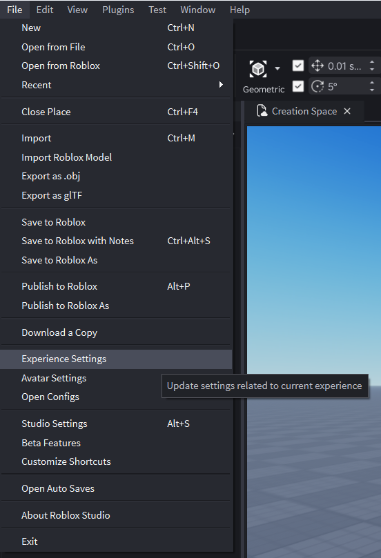
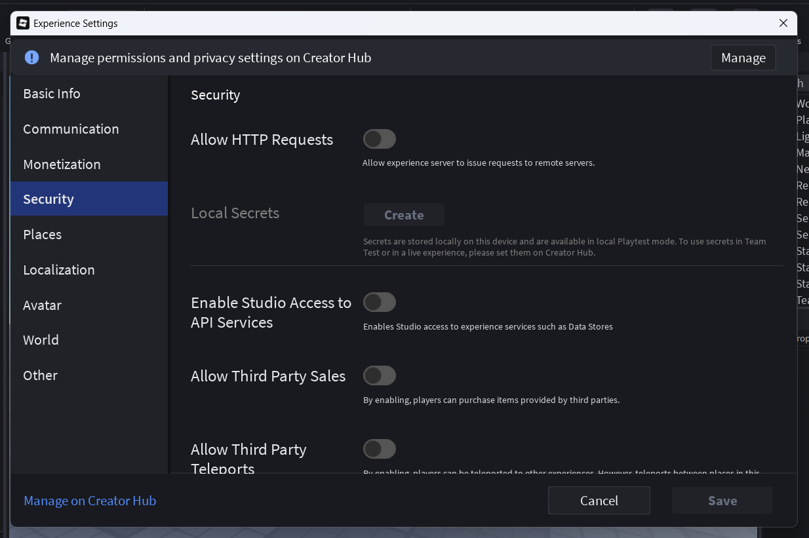
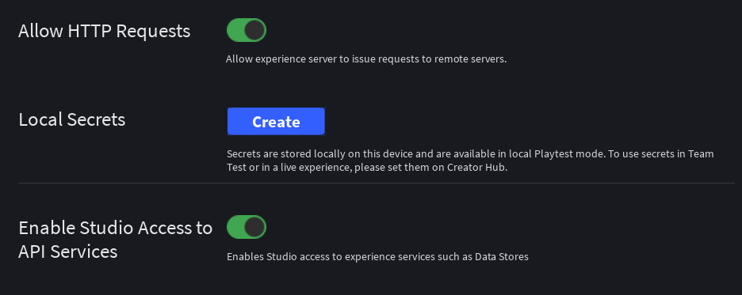

# The Basics


This guide only applies to Noren products purchased from **Parcel**.


Before you start using any Noren product, make sure that your game provides our products the necessary permissions to function.

Most tech products with licensing systems like Noren also require the same or similar steps in this guide.

***

## HTTP requests & API services

Noren products communicate with our licensing systems to enforce our Terms of Use and prevent unlicensed use. Our licensing module is required to interact with third-party APIs.

Noren products may also require to interact with Roblox API services to function.

Follow the step-by-step guide below to allow HTTP requests and access to Roblox API services.



### Open Experience Settings from File

Hover over "File" from the top left of Roblox Studio and you'll find "Experience Settings".

<figure><figcaption></figcaption></figure>



### Go to the Security tab

<figure><figcaption></figcaption></figure>



### Enable "Allow HTTP requests" and "Enable Studio Access to API Services"


You will spot a warning from Roblox warning you of third party attacks by allowing HTTP requests. Noren will never attempt to attack or backdoor your game in any way.


<figure><figcaption></figcaption></figure>



### Save your settings

Click "Save" at the bottom of the Game Settings window and you're all good to go!


