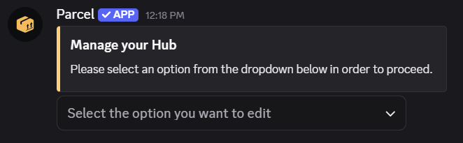
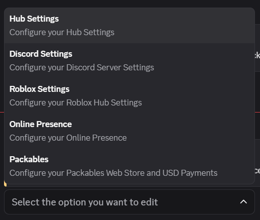
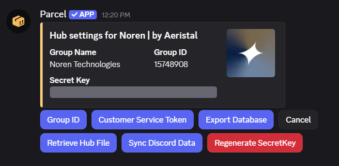

# Setup

## Setting up your secret key

Parcel Kiosk requires your hub's secret key for most of its functions. Noren **cannot see** your secret key!



### Open the Hub Settings menu

Run the `/settings` command in your Discord server and in the dropdown it sends to you, select "Hub Settings".

<figure><figcaption></figcaption></figure>

<figure><figcaption></figcaption></figure>



### Copy your secret key

Click on the spoilers to reveal your secret key and then copy it.

<figure><figcaption></figcaption></figure>



### Paste your secret key

Paste your secret key into the `SecretKey` field in the system configuration module.



### Done!

Your kiosks are now ready to use.


